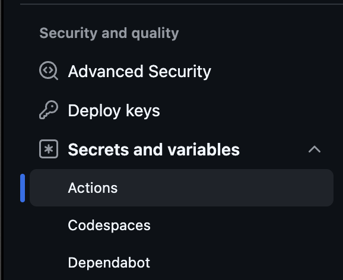
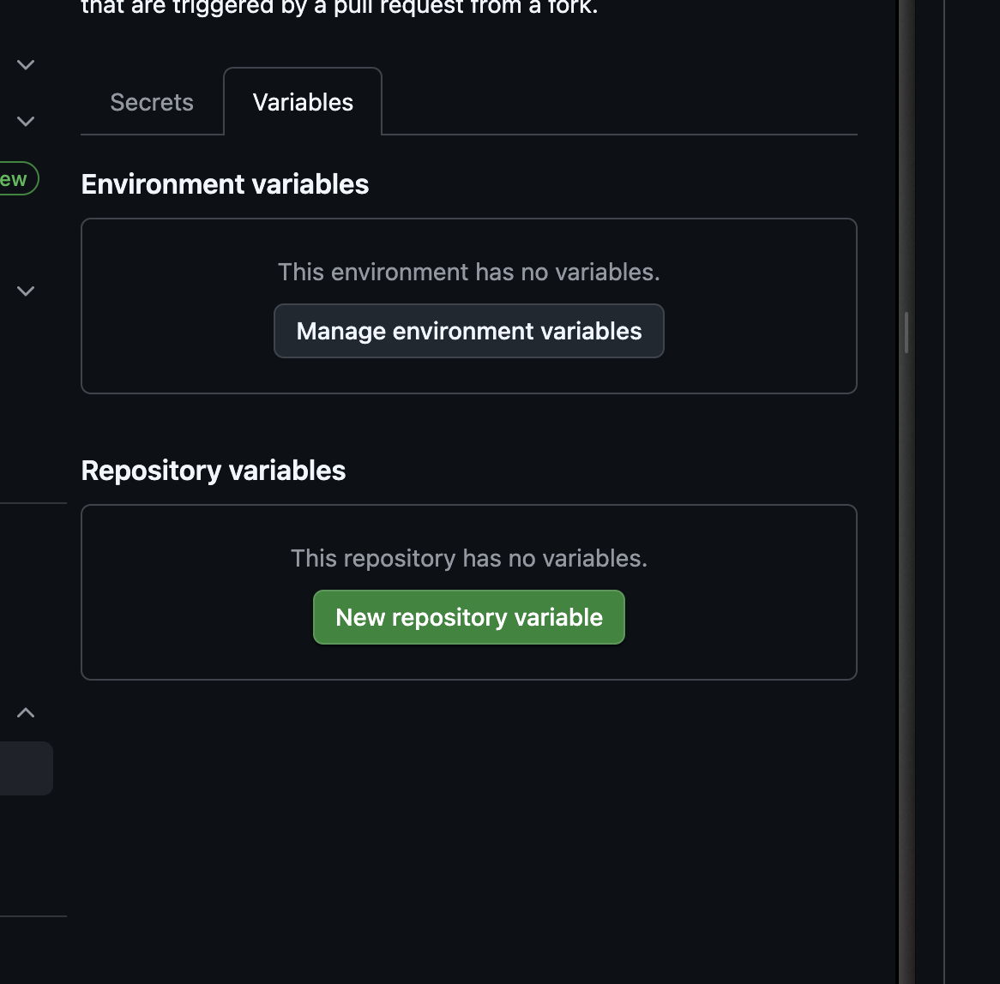
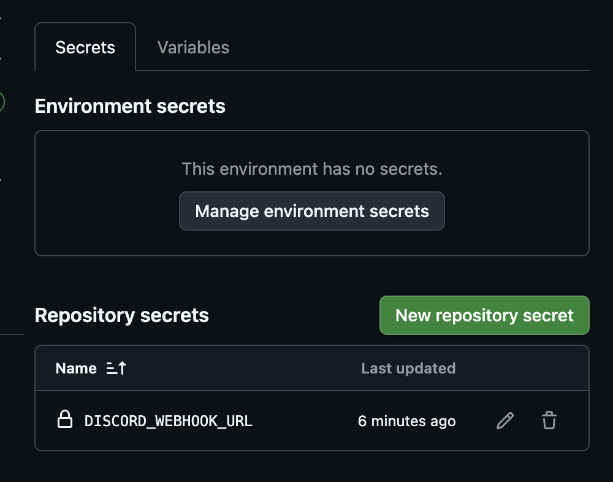
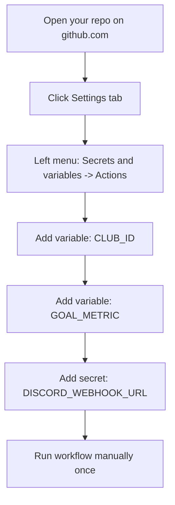
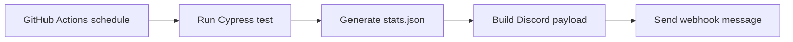
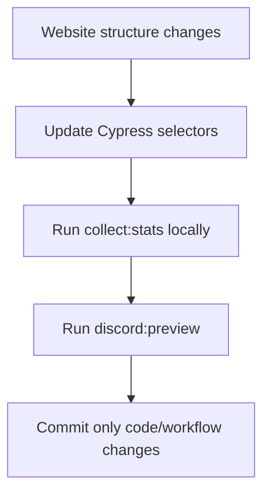

# Daily Discord Stats Bot

Small automation project that:
1. Collects club player stats from `uma.moe` with Cypress.
2. Saves the result to `stats.json`.
3. Sends a formatted message to Discord webhook.

## What You Need To Configure

Only 3 values are required:

- `CLUB_ID` (GitHub Actions **VARIABLE**)
- `GOAL_METRIC` (GitHub Actions **VARIABLE**)
- `DISCORD_WEBHOOK_URL` (GitHub Actions **SECRET**)

### Setup Diagram (Beginner Friendly)

If you are new to GitHub:

1. Open your repository page on GitHub.
2. Click the `Settings` tab (top menu).
3. In the left sidebar, go to `Secrets and variables` -> `Actions`.
4. Open the `Variables` tab and click `New repository variable`:
   - Add `CLUB_ID`
   - Add `GOAL_METRIC`
5. Open the `Secrets` tab and click `New repository secret`:
   - Add `DISCORD_WEBHOOK_URL`

Reference screenshots:







## How The Automation Works



Workflow file: `.github/workflows/daily-discord-stats.yml`

## Local Commands (Simple)

Install:

```bash
pnpm install
```

Collect stats locally:

```bash
pnpm run collect:stats
```

Preview Discord payload without sending:

```bash
GOAL_METRIC=100000 pnpm run discord:preview
```

Send to Discord:

```bash
DISCORD_WEBHOOK_URL="https://discord.com/api/webhooks/..." GOAL_METRIC=100000 pnpm run discord:send
```

## Production-Like Rules

- Do **not** commit generated files (`stats.json`, preview payloads).
- Do **not** commit `node_modules`.
- Keep secrets only in GitHub Secrets, never in code.
- Use the existing workflow schedule for daily execution.

## Change This If Needed

If the source website layout changes:

- Update selectors in `cypress/e2e/fishing-components.cy.js`
- Keep output format compatible with `scripts/discord-webhook.js`


